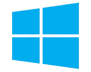
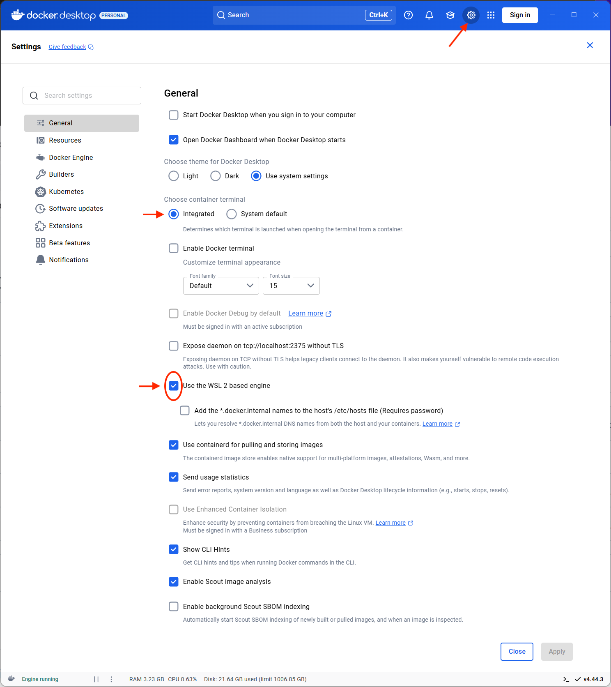
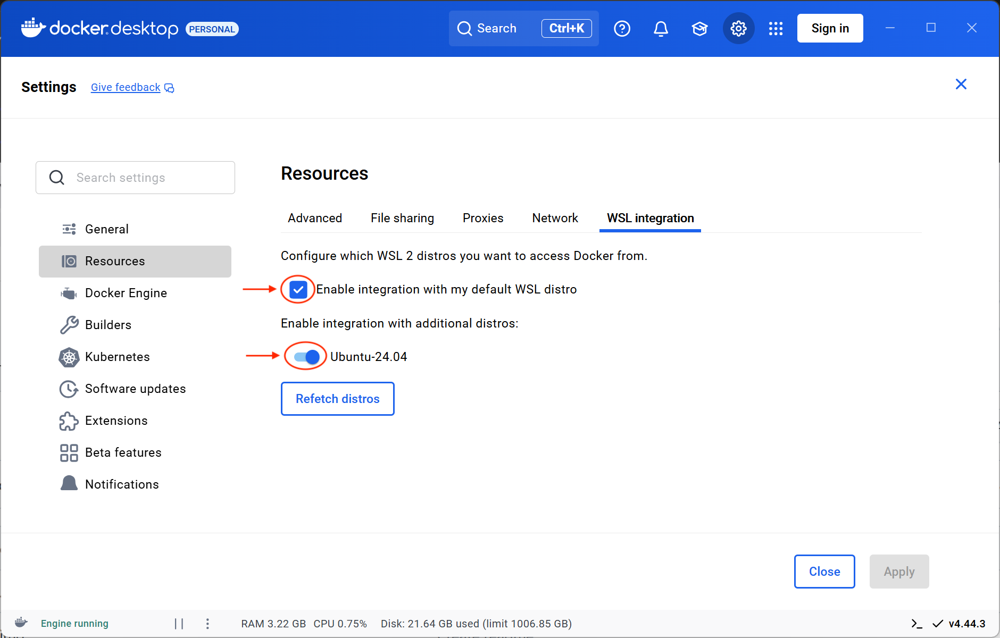
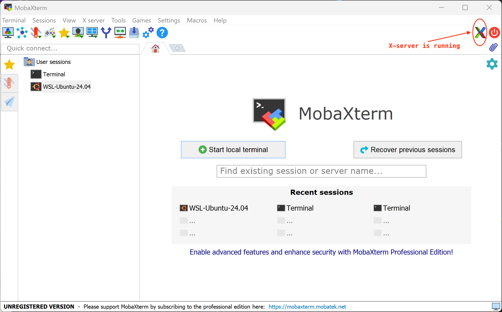
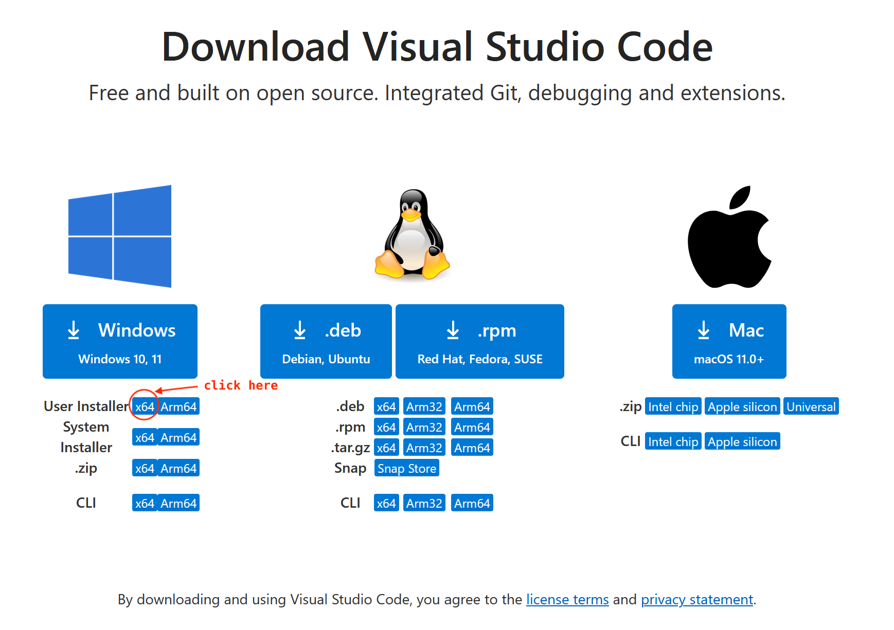
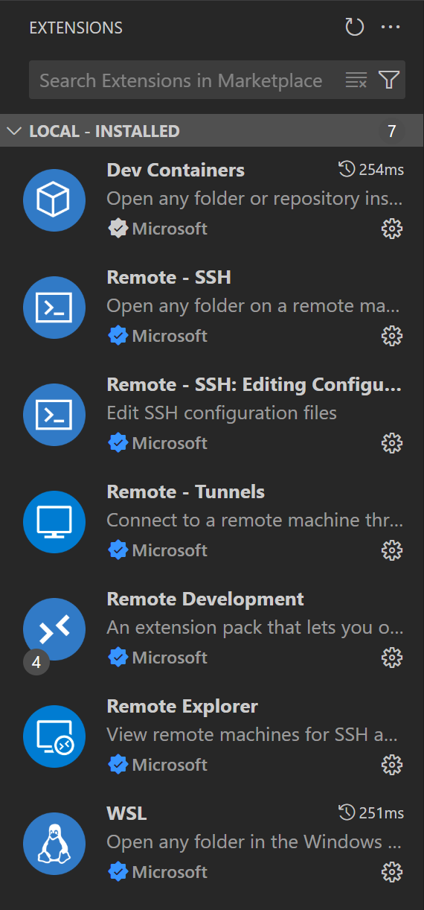
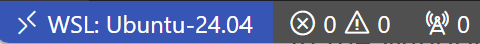
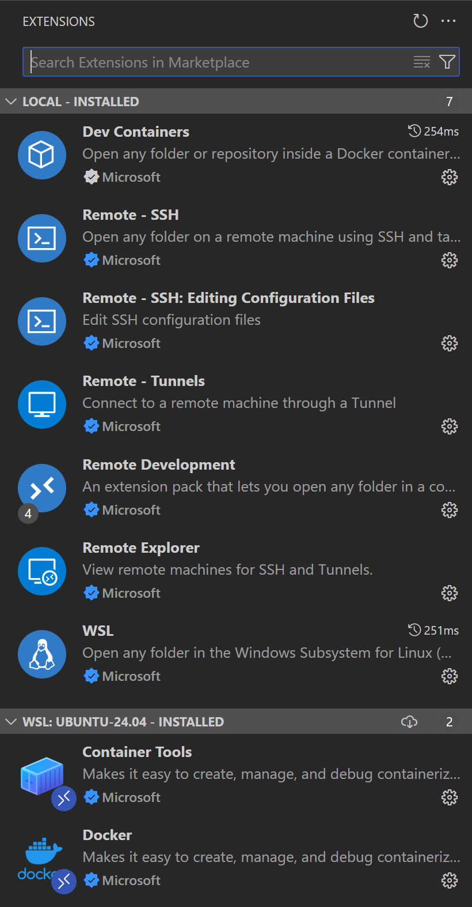

## Setting up the JKU's open source integrated circuits (osic) EDA tools on Windows OS 

1. **Make sure your system has the minimum requirements to support WSL 2** <br><br>
   WSL 2 is only available in Windows 11 or Windows 10, Version 1903, Build 18362 or later.<br>
   For the official documentation on WSL follow this [link](https://learn.microsoft.com/en-us/windows/wsl/)<br><br>
   To find the version of your Windows OS press the **`windows logo key + R`** and then type **`winver`** in the Run dialog box<br>
   or <br>
   navigate to `Start > Settings > System > About`<br><br>
   Alternatively, you can also run the following PowerShell command:
   ```
   systeminfo | findstr -r /C:"^OS Name:" /C:"^OS Version:"
   ```
   ---
   **Example**<br>
   I am using a Surface Book 3 with:
   ```
   OS Name:                       Microsoft Windows 11 Pro
   OS Version:                    10.0.26100 N/A Build 26100
   ```
   ---
2. **Install WSL 2**<br><br>
   To see the list of all avaliable Linux distribution use the following PowerShell command:<br>
   ```
   wsl.exe --list --online
   ```
   To install the latest LTS Ubuntu distribution run:
   ```
   wsl.exe --install -d Ubuntu-24.04
   ```
   You will be prompted to create a UNIX username and password.<br>
   This UNIX username and password have no relationship to your Windows username and password.<br>
   To avoid any confusion use a different username<br>
 
3. **Start WSL**<br><br>
   In general, to start using WSL, either open a PowerShell terminal and type:
   ```
   wsl ~
   ```
   or select the Ubuntu app in the Window's Start Menu.<br><br>
   The Linux user's home directory is:<br>
   `/home/<linux username>`<br>
   The Windows user's home directory is:<br>
   `/mnt/c/Users/<windows username>`<br><br>

   To check the version of Ubuntu installed type in the WSL terminal the following command:<br>
   ```
   cat /etc/os-release
   ```
   ---
   **Example**<br>
   >`talarico@TALARICO-SRFCBK:~$ pwd`<br>
   >`/home/talarico`
   
   >`talarico@TALARICO-SRFCBK:~$ cd /mnt/c/Users/claudio/`<br>
   >`talarico@TALARICO-SRFCBK:/mnt/c/Users/claudio$`
   ---
   To check which version of WSL you are running use the following PowerShell command:
   ```
   wsl --list
   ```
   or
   ```
   wsl --list --verbose
   ```
   It is recommended that you regularly update and upgrade your packages:
   ```
   sudo apt update -y && sudo apt upgrade -y
   ```
4. **WSL and GUI apps**<br><br>
   Since 2025-08-06 WSL supports running Linux GUI applications (X11 and Wayland) on Windows.<br><br>
   X11 has been for years the dominant display server protocol for Unix-like windowing systems.<br>
   Wayland was introduced in 2008 as a new protocol and a modern replacement for X11.<br>
   To install the apps and tools that ship with X11 run:<br> 
   ```
   sudo apt install x11-apps -y
   ```
   ```
   sudo apt install xterm -y
   ```
   and add the following line:
   ```
   export LC_ALL=C
   ```
   to the `~/.bashrc` file.<br>

   WSL 2 enables Linux GUI applications to be used on Windows and allows to:
   - Launch Linux apps from the Windows Start menu
   - Pin Linux apps to the Windows task bar
   - Use alt-tab to switch between Linux and Windows apps
   - Cut + Paste across Windows and Linux apps

5. **Accessing the WSL file system from Windows**<br><br>
   From the Power Shell terminal run the following command:<br>
   `explorer \\wsl$\Ubuntu-24.04\home\<linux username>`<br>

6. **Accessing the Windows file system from WSL**<br><br>
   `cd /mnt/c/Users/<windows username>`<br>
   To make it easier to navigate the windows file system, cosider adding symbolic links.<br>

   ---
   **Example**<br>
      ```
      ln -s /mnt/c/Users/claudio ~/whome
      ```
      ```
      ln -s /mnt/c/Users/claudio/icloudDrv/iCloudDrive ~/ihome
      ```
   ---
7. **[Install Docker Desktop on Windows](https://docs.docker.com/desktop/setup/install/windows-install/)**
8. **Start Docker Desktop and configure it**<br><br>
   Start Docker and open the **Settings** wheel at the top of the menu bar.<br> 
   Go to the tab **General** and make sure the "Use the WSL 2 based engine" option is enabled.
    <p align="center">
       
    </p>
    
   Go to the tab **Resources → WSL Integration** and enable Ubuntu-24.04. This will allow us to run Docker in Ubuntu WSL terminal.
<p align="center">
       
    </p>

   
9. **Clone the [iic-osic-tools](https://github.com/iic-jku/IIC-OSIC-TOOLS) container onto your WSL user's home folder**<br>
   ```
   cd ~
   git clone --depth=1 https://github.com/iic-jku/iic-osic-tools.git
   ```
10. **Browse to the iic-osic-tools directory**<br>
    ```
    cd ~/iic-osic-tools
    ```

11. **Start the iic-osic-tools container using the script `./start_x.sh`**<br><br>
    ... But, before we can successfully run the script `./start_x.sh` there are a few more steps that needs to be to completed:
    1. Install and run an Xserver for Windows (MobaXterm)
    2. The `.Xauthority` file
    3. Set the `DESIGNS` variable inside `./start_x.sh`
    4. Install a few required additional Linux packages
   
12. **Install and start [MobaXterm Home Edition](https://mobaxterm.mobatek.net/download.html)** <br><br>
    Among its many features MobaXterm provides a fully configured Xserver with built-in X11 forwarding to display graphical applications.
    <p align="center">
       
    </p>

13. **The `.Xauthority` file**<br><br>
    Make sure there is a file `.Xauthority` in the WSL user's home directory.<br>
    In the unfortunate event that the `.Xauthority` does not exist, below are the steps to manually create it:
    ```
    cd ~
    touch ~/.Xauthority
    # Generate the magic cookie with 128 bit hex encoding
    xauth add ${HOST}:0 . $(xxd -l 16 -p /dev/urandom)
    # Verify the result and it shouldn't show any error
    xauth list
    ```
    
14. **Set the `DESIGNS` variable**<br><br>
    In the script `start_x.sh`, all user data is persistently mounted in the directory pointed to by the environment variable `DESIGNS`<br>
    The default is `$HOME/eda/designs`<br>
    To change where the user data is mounted edit the `start_x.sh` script and modify the definition of the variable `DESIGNS`<br><br>
    
    ---
    **Example**<br>
    To have all designs' data accessible from multiple platforms and multiple OS, I am going to set the `DESIGNS` variable to point to my own Google Drive.<br>
    On my Windows machine Google Drive is mapped on the `G:` drive, so before I can really do anything I must mount the Windows' `G:` drive to a WSL's folder and have ownership of it.<br> 
    To find out the uid and gid of the WSL's user (talarico) use the linux command:
    ```
    id
    ```
    The uid and gid of the WSL's user are:<br>
    `uid=1000(talarico) gid=1000(talarico)` <br><br>
    
    The uid and gid for the Windows' user (claudio) are:<br>
    `uid=1002(claudio) gid=513(UsersGrp)`<br>
    
    At this point we can finally mount the `G:` drive on WSL. Open the WSL terminal and type the following commands: 
    ```
    sudo mkdir -p /mnt/g
    sudo mount -t drvfs G: /mnt/g -o metadata,uid=1000,gid=1000
    ```
    To test the mount operation was successful run:
    ```
    sudo mount -a
    ```
    For convenience create a link to the Google Drive folder.
    ```
    ln -s /mnt/g/My\ Drive/ ~/ghome
    ```
    To make the the mounting permanent we must **modify** the **`/etc/fstab`** file.<br>
    Add the following line to the `/etc/fstab`:<br>
    ```
    G: /mnt/g drvfs rw,uid=1000,gid=1000 0 0
    ```
    To test the changes to the `fstab` file are successful run:
    ```
    sudo mount -a
    ```
    For `/etc/fstab` to be processed correctly on boot, in modern WSL distributions, you need to enable `systemd`.<br>
    Check that the `/etc/wsl.conf` file contains the following few lines:
    ```
    [boot]
    systemd = true

    [user]
    default = talarico

    [automount]
    enabled = true
    mountFsTab = true         
    ```
    For the `systemd` setting to take effect, you must fully shut down and restart WSL.<br>
    Open a Windows PowerShell (not your WSL terminal) and run the following command:
    ```
    wsl --shutdown
    ```
    After it completes, you can open your WSL distribution again.<br>

    Finally, browse to the location of the `start_x.sh` script:
    ```
    cd ~/iic-osic-tools
    ```
    and edit the `DESIGNS` variable inside the `start_x.sh` script as follows:
    ```
    DESIGNS=$HOME/ghome/eda/designs
    ```
    ---
    
15. **Install a few additional required Linux packages**<br>
    ```
    sudo apt -y install socat
    sudo apt -y install x11-xserver-utils
    ```
    
16. **Start the iic-osic-tools container**<br><br>
    Browse to the location of the `start_x.sh` script:
    ```
    cd ~/iic-osic-tools
    ```
    and start the script:
    ```
    ./start_x.sh
    ```
    If everything goes as it should, you will see a terminal with the prompt `/foss/designs >`<br>
    This is your working directory where all your design data goes.<br>
    If you are curious to see what version of the iic osic tools you are running use the command:<br>
    ```
    echo $IIC_OSIC_TOOLS_VERSION
    ```

17. **Install VS Code and the WSL extension**<br><br>
    Visual Studio Code, along with the WSL extension, enables you to use WSL as your full-time development environment directly from VS Code.<br>
    - Visit the [VS Code install](https://code.visualstudio.com/download) page and select the **Windows installer** for your current system architecture.<br>
      Install Visual Studio Code on Windows (**not in WSL**).

      ---
      **Example**<br>
      <p align="center">
         
      </p>
      
      Download and install:<br>
      `VSCodeUserSetup-x64-1.103.2.exe`
      
      ---
    - When prompted to Select Additional Tasks during installation, be sure to check the **Add to PATH** option so you can easily open a folder in WSL using the code command.
    - Install the [Remote Development extension pack](https://marketplace.visualstudio.com/items?itemName=ms-vscode-remote.vscode-remote-extensionpack).         This extension pack includes the WSL extension, in addition to the Remote - SSH, and Dev Containers extensions, enabling you to open any folder in a container, on a remote machine, or in WSL.<br><br>
      The Remote Development extension pack includes four extensions:
      - Remote - SSH 
      - Remote - Tunnels 
      - Dev Containers 
      - WSL

      To see all the extensions installed click on the extensions icon on the activity bar  or press **`Ctrl+Shift+x`**
      <p align="center">
         
      </p>
   
      
      - "Remote Explorer" is an auxliary extension that works in conjunction with  "Remote - SSH" and "Remote - Tunnels"
      - "Remote - SSH: Editing Configuration Files" is an auxiliary extension that allows to perform Remote - SSH with configuration files
        
      With the WSL extension installed, you will see a new Status bar item at the bottom far left 
      <p align="center">
         
      </p>

      Click on the context indicator icon  at the bottom far left and run the command **Connect to WSL**
      <p align="center">
         
      </p>
   
      In VS code all possible commands are accessible either navigating the top menu bar to **`View > Command Palette`** or pressing<br> **`Ctrl + Shift + p`**.

    - Install also the recommended Docker extension 

      <p align="center">
         
      </p>
   
      Too see only the installed extensions type **`@installed`** in the "Search Extensions in Marketplace" bar

